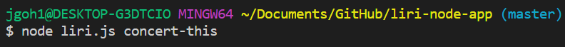
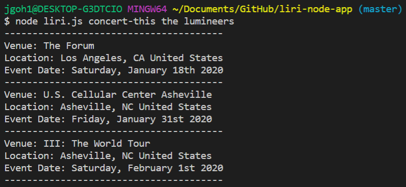
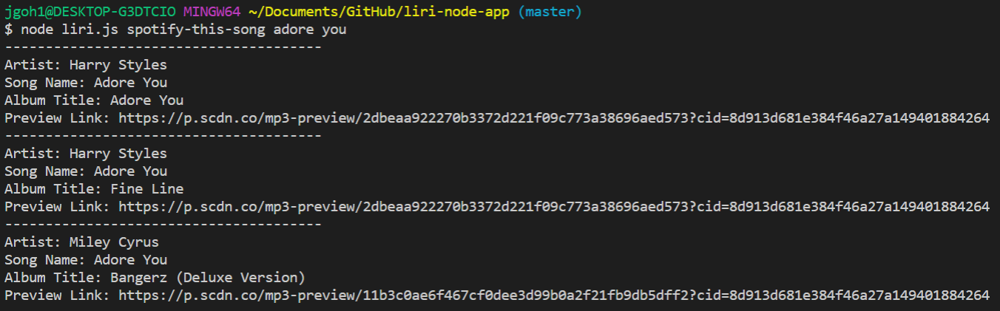
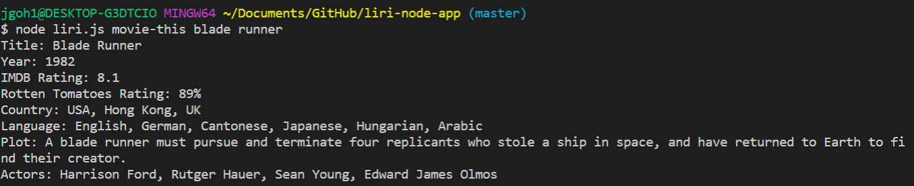
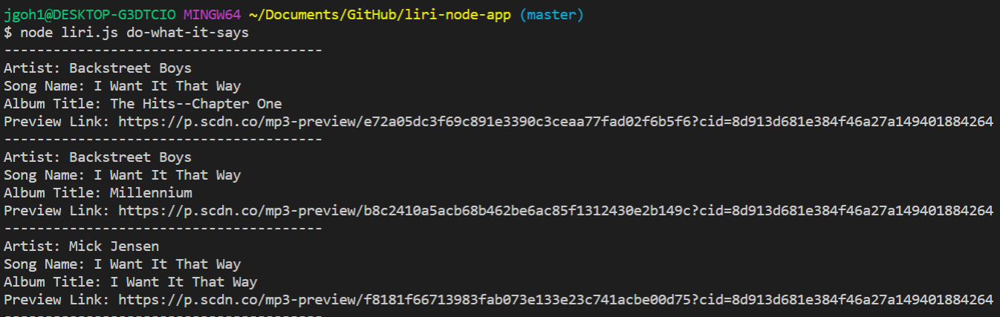

# liri-node-app
This is a Language Interpretation and Recognition Interface (LIRI) app similar to the Speech Interpretation and Recognition Interface (SIRI) used in iPhones. While SIRI uses speech, LIRI utilizes command line node that takes in parameters and gives back data. This particular app searches Spotify for songs, Bands in Town for concerts, and OMDB for movies.

## Overview
This app uses the command line iN the CLI to generate a response from the functions in the application. To retrieve the data that will power this app, users will require:
 (1) node.js, 
 (2) node modules for relevant npm - axios, moment, 
 (3) Spotify API client id and client secret

## Instructions
User will require to input the command for the selected options in the terminal:
- concert-this
- spotify-this-song
- movie-this
- do-what-it-says

Example:

## concert-this
The user will be able to search for upcoming concerts by artist or band via Bands In Town api. This will provide concerts venue, location and date.

## spotify-this-song
Searching for songs is made easy with this app retrieving from Spotify api. This will provide relevant information and url link to sample the music.

## movie-this
This allow user to search for movies information from the OMDB api . This will provide information on year, ratings,country, language, plot and actors.

## do-what-it-says
This option will provide a suggested information link to the text file for a spotify-this-song search for "I want it that way".

## Future improvements
- [ ] Incorporate inquirer to make selection for options.

- [ ] Introduce other api (cinemas) to expand scope of the app.
